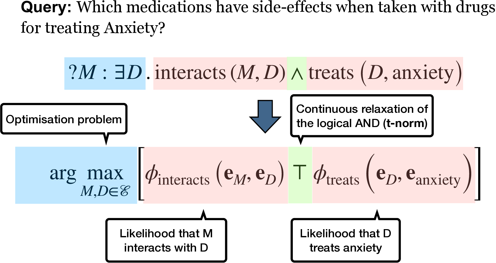
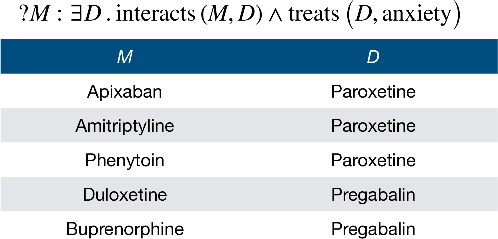

# UCL Researchers win ICLR Outstanding Paper Award

Erik Arakelyan, a former ML MSc student at UCL and his MSc thesis supervisor [Pasquale Minervini](https://neuralnoise.com/), together with [Daniel Daza](https://dfdazac.github.io/) and [Michael Cochez](https://www.cochez.nl/) from Vrije Universiteit Amsterdam and Elsevier Discovery Lab, won an [Outstanding Paper Award](https://iclr-conf.medium.com/announcing-iclr-2021-outstanding-paper-awards-9ae0514734ab) for the forthcoming International Conference on Learning Representations ([ICLR 2021](https://iclr.cc/)), one of the leading Machine Learning conferences. Among 2670 submissions, 860 papers were selected to appear in the ICLR 2021 program, and 8 were deemed as especially noteworthy and were awarded an Outstanding Paper Award. This project was supported by [CLARIFY](https://clarify2020.eu/), an EU-funded project started in 2020 and managed by Pasquale on the UCL end, that aims at improving the quality of life in cancer survivors via Knowledge-aware Machine Learning models.

Their paper, [Complex Query Answering with Neural Link Predictors](https://openreview.net/forum?id=Mos9F9kDwkz), proposes a novel framework for answering complex queries on large-scale and incomplete Knowledge Graphs. Knowledge Graphs are a widespread formalism for representing knowledge in a way that is processable by machines and power many of the services we use every day, including [Google Search and the Facebook Social Graph](https://cacm.acm.org/magazines/2019/8/238342-industry-scale-knowledge-graphs/fulltext). However, most real-world Knowledge Graphs tend to be largely incomplete, severely reducing their range of applications.

To tackle the inherent incompleteness of Knowledge Graphs, a common approach is to resort to Machine Learning techniques.
For instance, on the task of answering complex queries (such as *Which drugs interact with medications for treating Anxiety?*), a common approach so far consisted in representing the complex query as a *continuous vector*, and training a *deep neural network* to produce the correct answers, given the query representation. However, this approach can require *tens of millions of examples* to train the deep neural network; produces no explanations for its answers; and it is not clear whether it will generalise to query types that were not observed during training.

The UCL researchers proposed a novel and data-efficient solution to this problem. They train a Machine Learning model to answer *simple queries*, and translate each complex query into an *optimisation objective*, whose solution produces an answer to all the simple queries that compose the complex queries.

Their approach produces more accurate results than state-of-the-art methods, without the need of training on a large and diverse set of complex queries: using orders of magnitude less training data, they achieve results that are from 8% up to 40% more accurate than state-of-the-art methods proposed so far

Furthermore, they show that it is possible to explain the answers produced by teir model in terms of the intermediate solutions identified for each of the complex query atoms. 

The eight winning papers will be presented during two Outstanding Paper sessions on May 5 and 6.  To attend the event, individuals can [register at this link](https://iclr.cc/Register/view-registration).